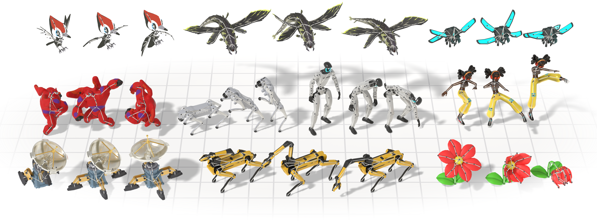

<h1 align="center">UniMate</h1>

<p align="center"><b>One Unified Model to Animate Diverse Skeletons</b></p>

<p align="center">
  <a href="https://linzhanm.github.io/unimate/"></a>
  <a href="https://linzhanmou.com/unimate/resources/unimate.pdf"></a>
  <a href="https://linzhanmou.com/unimate/interactive.html"></a>
  <a href="https://huggingface.co/Linzhan"></a>
  <a href="https://asia.siggraph.org/2026/"></a>
</p>

<p align="center">
  <a href="https://linzhanm.github.io/">Linzhan Mou</a> ·
  <a href="https://jiahuilei.com/">Jiahui Lei</a> ·
  <a href="https://frank-zy-dou.github.io/">Zhiyang Dou</a> ·
  <a href="https://chenyue-cai.com/">Chenyue Cai</a> ·
  <a href="https://chaoyuesong.github.io/">Chaoyue Song</a> ·
  <a href="https://www.cs.princeton.edu/~af/">Adam Finkelstein</a> ·
  <a href="https://www.cs.princeton.edu/~smr/">Szymon Rusinkiewicz</a>
</p>

<p align="center">Princeton · UC Berkeley · MIT · NTU</p>

<div align="center">
    
</div>

---

## 🔥 News

- **[TODO]** Training and inference code will be released in this repository soon.
- **[2026-08-30]** The **UniML3D dataset** and its [data-processing pipeline](data_process/) are released. 🚀
- **[2026-08-01]** Our [Interactive Demo](https://linzhanmou.com/unimate/interactive.html) is live — browse our animation results in 3D. 🎮
- **[2026-07-18]** UniMate is accepted to SIGGRAPH Asia 2026! 🎉

## 🛠️ Environment Setup

All components share a single conda environment, specified in [`requirements.txt`](requirements.txt):

```bash
conda create -n unimate python=3.10 -y
conda activate unimate
pip install "setuptools<81"
pip install -r requirements.txt --no-build-isolation
```

## 📊 Dataset & Data Processing

We introduce **UniML3D**, a large-scale dataset of 13,006 text-paired motion sequences covering diverse skeletal topologies — bipedal, quadrupedal, avian, marine, insectoid, serpentine, and articulated rigid objects — all brought into a unified canonicalization.

The raw source assets are available on the Hugging Face Hub: [Mixamo-Animations-Characters](https://huggingface.co/datasets/Linzhan/Mixamo-Animations-Characters), [Objaverse-XL-Rigged-Animated](https://huggingface.co/datasets/Linzhan/Objaverse-XL-Rigged-Animated) and [Truebones-ZOO-Annotations](https://huggingface.co/datasets/Linzhan/Truebones-ZOO-Annotations) (prompts, metadata and renders only). The Truebones ZOO animal motions themselves are a commercial asset pack whose license does not permit redistribution — please purchase the pack directly from [Truebones](https://truebones.com); our pipeline consumes the stock `Truebone_Z-OO` folder layout as-is.

<div align="center">
    
</div>

See [`data_process/README.md`](data_process/README.md) for the full data processing pipeline that turns the raw assets into UniML3D (download → export → rendering → captioning → joint annotation → feature extraction → animation).

## 🎬 Inference

Given a rigged 3D asset and a text prompt, UniMate generates articulated motion for arbitrary skeletons in real time — with no per-skeleton retraining and no test-time optimization.

<div align="center">
    
</div>

## 📝 Citation

If you find UniMate useful in your research, please consider citing our work:

```bibtex
@inproceedings{mou2026unimate,
  title={UniMate: One Unified Model to Animate Diverse Skeletons},
  author={Mou, Linzhan and Lei, Jiahui and Dou, Zhiyang and Cai, Chenyue and Song, Chaoyue and Finkelstein, Adam and Rusinkiewicz, Szymon},
  booktitle={SIGGRAPH Asia 2026},
  year={2026}
}
```

## ⚖️ License

The code in this repository is released under the [MIT License](LICENSE).

The datasets remain governed by the licenses of their original sources: the [Mixamo](https://www.mixamo.com/) assets by Adobe's Mixamo terms of use, the [Objaverse-XL](https://objaverse.allenai.org/) assets by the license attached to each original object, and the Truebones ZOO motions by [Truebones](https://truebones.com)' commercial license. Please review and comply with the respective source licenses before using the data.
