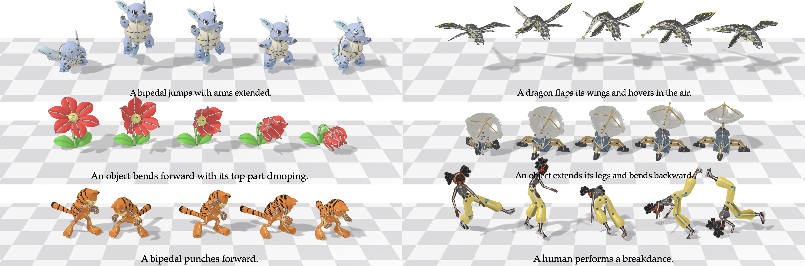
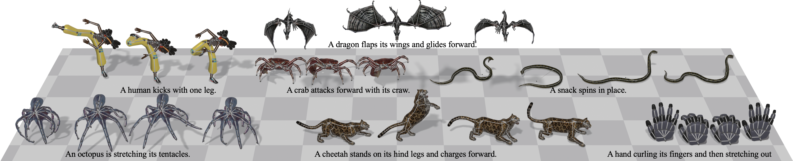

<h1 align="center">UniMate</h1>

<p align="center"><b>One Unified Model to Animate Diverse Skeletons</b></p>

<p align="center">
  <a href="https://linzhanm.github.io/unimate/"></a>
  <a href="https://linzhanmou.com/unimate/resources/unimate.pdf"></a>
  <a href="https://linzhanmou.com/unimate/interactive.html"></a>
  
</p>

<p align="center">
  <a href="https://linzhanm.github.io/">Linzhan Mou</a> ·
  <a href="https://jiahuilei.com/">Jiahui Lei</a> ·
  <a href="https://frank-zy-dou.github.io/">Zhiyang Dou</a> ·
  <a href="https://chenyue-cai.com/">Chenyue Cai</a> ·
  <a href="https://chaoyuesong.github.io/">Chaoyue Song</a> ·
  <a href="https://www.cs.princeton.edu/~af/">Adam Finkelstein</a> ·
  <a href="https://www.cs.princeton.edu/~smr/">Szymon Rusinkiewicz</a>
</p>

<p align="center">Princeton · UC Berkeley · MIT · NTU</p>

<!--
<div align="center">

https://github.com/user-attachments/assets/a4efca07-8673-4ddf-8057-b8be7b008265

</div>
-->

---

## 📜 News

- **[TODO]** Training code and the UniML3D dataset will be released in this repository around August 2026.
- **[2026-07-18]** UniMate is accepted to SIGGRAPH Asia 2026! 🎉

## 🖼️ Inference

Given a rigged 3D asset and a text prompt, UniMate generates articulated motion for arbitrary skeletons in a single forward pass — with no per-skeleton retraining and no test-time optimization.

<div align="center">
    
</div>

## 📊 Dataset

We introduce **UniML3D**, a large-scale dataset of 13,006 text-paired motion sequences covering diverse skeletal topologies — bipedal, quadrupedal, avian, marine, insectoid, serpentine, and articulated rigid objects — all brought into a unified canonicalization.

<div align="center">
    
</div>

## 📄 License

This project is released under the [MIT License](LICENSE).

## 📝 Citation

If you find UniMate useful in your research, please consider citing our work:

```bibtex
@inproceedings{mou2026unimate,
  title={UniMate: One Unified Model to Animate Diverse Skeletons},
  author={Mou, Linzhan and Lei, Jiahui and Dou, Zhiyang and Cai, Chenyue and Song, Chaoyue and Finkelstein, Adam and Rusinkiewicz, Szymon},
  booktitle={SIGGRAPH Asia 2026},
  year={2026}
}
```
