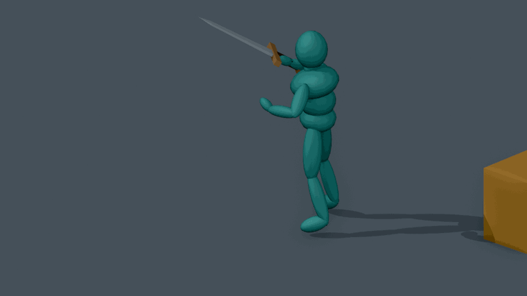
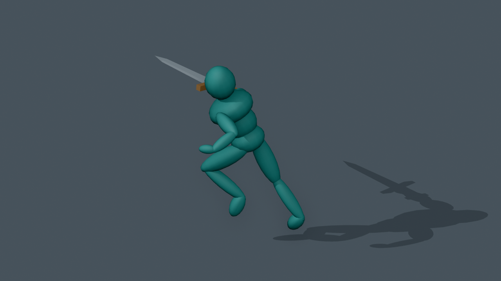
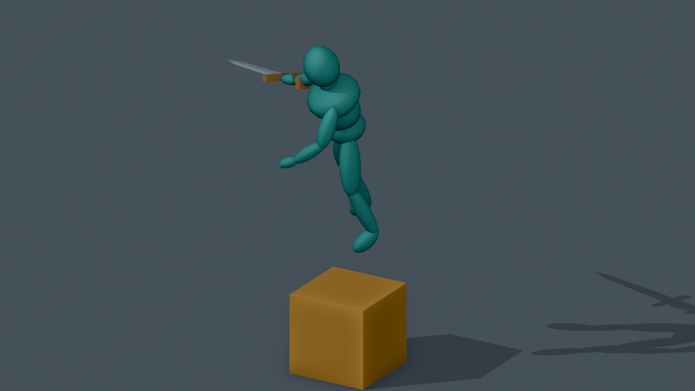
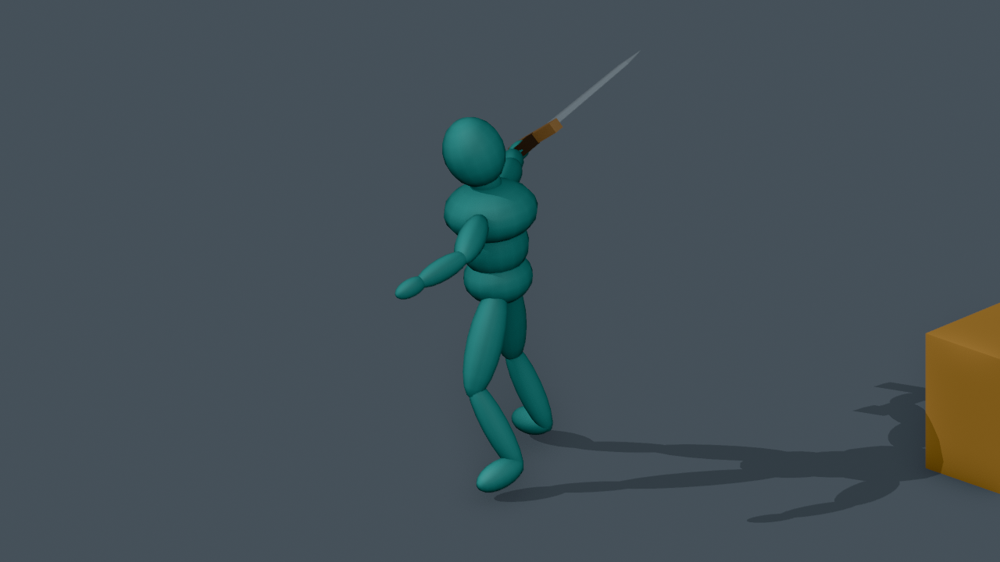
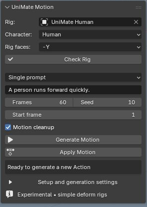
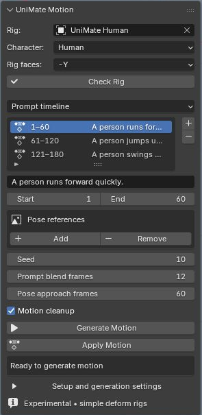

# UniMate-B3D

**Local text-to-motion for simple deform-bone rigs in Blender.** This is a fork of [Friedrich-M/UniMate](https://github.com/Friedrich-M/UniMate) that adds a Blender panel, a separate inference backend, prompt timelines, pose references, and an editable Blender Action. Maintained by **Nopeburger**.

| Running | Jumping over a cube | Sword swing |
| :---: | :---: | :---: |
|  |  |  |

The [demo scene](demo/UniMate_Run_Jump_Sword.blend) contains a human deform rig, sword, obstacle cube, ground plane, and a 180-frame Action. Frames **1–60** run, **61–120** jump over the cube and land, and **121–180** swing the sword. Open it in Blender and press Play; the animation works without the model weights. This Action began with UniMate output, then received a deterministic 1.5-unit forward jump arc and contact/knee cleanup so it clears the visible cube. The GIF shows the sword portion of that Action.

## Requirements

- Blender **4.2 or newer** (developed and checked with Blender 5.1).
- Windows, standard **Python 3.10**, and an NVIDIA GPU compatible with the bundled CUDA 12.4 PyTorch requirements for the provided setup script. Other platforms need their own PyTorch installation and setup adjustments.
- Several GB of free space for Python dependencies, the UniMate checkpoint, and the text encoder. Model weights are downloaded during setup; they are not in this repository or the add-on ZIP.

Inference runs in a separate Python environment. Blender's Python does not need PyTorch.

## Install

1. Clone this fork: `git clone https://github.com/nopeburger/UniMate-B3D.git` and enter `UniMate-B3D`.
2. With Python 3.10 available through the Windows `py` launcher, run `powershell -ExecutionPolicy Bypass -File .\scripts\setup.ps1` from the repository root. You can pass `-Python <path-to-python-3.10>` if needed. This creates `.venv` and downloads the UniMate and human-pose models into `models/`.
3. In Blender, choose **Edit → Preferences → Get Extensions → Install from Disk** (or **Add-ons → Install from Disk**, depending on Blender version), select [`dist/unimate_motion-0.3.0.zip`](dist/unimate_motion-0.3.0.zip), and enable **UniMate Motion**.
4. In the 3D View, open the sidebar with **N**, select **UniMate**, and expand **Setup and generation settings**. Set **Project folder** to the cloned repository root and **Model folder** to `models/unimate_uniml3d_f60_v2` inside that root. These paths are local settings and are not bundled in the demo.

To build the add-on ZIP from source instead, run `python scripts/package.py`. Its package is intentionally small; the backend and weights stay in the cloned project.

## Add-on panel

The [Blender add-on panel guide](docs/BLENDER_ADDON_GUIDE.md) explains every control, including rig setup, prompt ranges, pose references, cleanup, generation, and advanced settings. It also shows screenshots of the single-prompt, timeline, pose-reference, and advanced panels.

| Single prompt | Prompt timeline |
| :---: | :---: |
|  |  |

## Generate motion

1. Select a simple, single-root deform armature, or assign it in **Rig**. Choose **Human**, **Animal / Creature**, or **Other articulated model**, set the direction the rig faces in armature-local space, and click **Check Rig**.
2. For one motion, choose **Single prompt**, enter the prompt, frame count, and start frame. For a sequence, choose **Prompt timeline** and add prompt clips with inclusive, consecutive frame ranges. There can be no gaps or overlaps. Each prompt generates up to 60 new frames; longer ranges retime that motion.
3. Optionally assign a static **Ground mesh** in the advanced settings. **Motion cleanup** is enabled by default and estimates self-collisions, ground penetration, stance, foot/paw tilt, and support-limb bend from the rig's weighted meshes.
4. Click **Generate Motion**. Blender remains interactive while the local backend runs. When the status reports that motion is ready, click **Apply Motion**. This creates a new Action; save your `.blend` file.

The first generation also fetches the text encoder into the local cache. Each job writes its request, status, log, and result under the local `outputs/` directory. These files are excluded from Git.

### Pose references

Each prompt clip can contain one or more reference images assigned to target frames. For a **human**, choose the image, click **Estimate Human Pose**, review or change the human bone mapping, click **Preview Estimated Pose**, adjust the rig if needed, and click **Capture Current Pose**. For a **creature**, use the image as a guide to pose the rig manually, then capture it. The captured pose is the actual constraint; selecting an image alone does not impose a pose. Uncaptured references stop generation with an error.

**Prompt blend frames** smooth joins between clips. **Pose approach frames** ease into a captured reference within its clip. Both controls can be set to zero. Cleanup may adjust an intersecting captured pose; turn it off when exact reference rotations matter more. Single-image human pose estimation cannot reliably infer hidden limbs, depth, or ground contact, so review every estimate.

## Scope and limits

This is an experimental adapter for **simple deform-bone human and creature rigs**. Active pose constraints, drivers, NLA tracks, and control rigs are not supported directly. The downloaded v2 checkpoint permits at most **71 model joints**, counting virtual terminal joints. Motion cleanup uses capsule proxies derived from skin weights and heuristic foot contact; it is not a physics simulation and cannot guarantee collision-free output on every mesh. Contact uncertainty is reported in job results. Creature pose images are manually matched in this version.

The backend builds UniMate conditioning from the Blender rest skeleton and uses upstream model/sampler code without editing the upstream source. See [the original README](docs/UPSTREAM_README.md) and [the UniMate project](https://github.com/Friedrich-M/UniMate) for the underlying research and model.

## Licenses and credits

Upstream UniMate code is MIT licensed; its original [license](LICENSE) and [README](docs/UPSTREAM_README.md) are retained. The Blender integration in `addon/unimate_motion` is GPL-3.0-or-later ([license](addon/unimate_motion/LICENSE.txt)). The integration also includes the upstream MIT notice ([notice](addon/unimate_motion/UNIMATE_LICENSE.txt)). No training dataset, model weights, external character assets, or development outputs are bundled.
