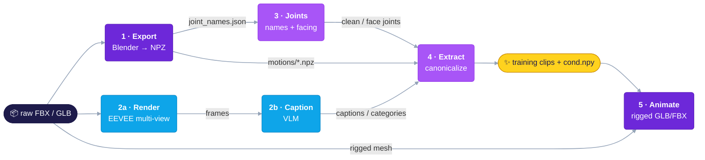

# UniML3D Data Processing

The pipeline that turns raw rigged assets (Truebones FBX, Mixamo FBX, Objaverse GLB) into **UniML3D** — the text-paired, topology-annotated motion clips used to train UniMate.

**How to read this document.** All commands are run **from the repository root**. Each stage lists the commands you need first; the collapsible **Details / Advanced / Reference** blocks hold the knobs, mechanics, and field tables. Every wrapper also prints its own usage with `-h`.

## Table of Contents

- [Overview](#overview)
- [Requirements](#requirements)
- [Directory Layout](#directory-layout)
- [Getting the Raw Data](#getting-the-raw-data)
- [Quick Start](#quick-start)
- [Pipeline Stages](#pipeline-stages)
  - [Stage 1 — Export](#stage-1--export-raw-assets--npz)
  - [Stage 2a — Render](#stage-2a--render-multi-view-frames--t-pose-grids)
  - [Stage 2b — Caption](#stage-2b--caption-renders--text)
  - [Stage 3 — Joint annotation](#stage-3--joint-annotation-name-cleanup--facing-direction)
  - [Stage 4 — Extract](#stage-4--extract-npz--metadata--training-clips)
  - [Stage 5 — Animate](#stage-5--animate-drive-a-mesh-with-a-motion)
- [Custom Assets](#custom-assets)
- [Data Formats](#data-formats)
- [Tools](#tools)
- [Conventions](#conventions)
- [Troubleshooting](#troubleshooting)

## Overview



| Stage | Wrapper(s) | Input | Output |
|-------|-----------|-------|--------|
| 0. Download | `run_download.sh` | Hugging Face Hub | `dataset/raw/<dataset>/` |
| 1. Export | `run_export.sh`, `run_export_general.sh` | raw FBX / GLB | `export/<dataset>/{motions/*.npz, videos/*.mp4, tpose/*.png}` + summary JSONs |
| 2a. Render | `run_render_motion.sh`, `run_render_tpose.sh` | raw FBX / GLB (mixamo: animated characters) | `render/<dataset>/<clip>/v00{0..3}/`, `render/<dataset>_tpose/<name>.png` |
| 2b. Caption | `run_caption_motion.sh`, `run_caption_category.sh` | multi-view renders | `motion_captions.json`, `category_groups.json` |
| 3. Joints | `run_joints_*.sh` | `joint_names.json` | `clean_joint_names.json`, `face_joint_names.json` |
| 4. Extract | `run_extract_features.sh` | export NPZs + stage-2/3 JSONs | per-clip NPZs, `cond.npy`, `captions.json` |
| 5. Animate | `run_animate_{motion,npz,fbx,mixamo,lbs}.sh`, `run_preprocess_char.sh` | motion clip + rigged mesh | animated `.glb` / `.fbx` |

Stages 1 and 2a both read the raw assets and can run in either order or in parallel. Stage 3 needs stage 1's `joint_names.json`, stage 2b needs stage 2a's renders, and stage 4 needs all three.

> [!NOTE]
> **Mixamo runs stage 5 in the middle of the pipeline.** Raw Mixamo FBXs are animation-only (armature without mesh), so the render/caption input has to be produced first by `run_animate_mixamo.sh`: export → animate a character → render → caption. The result also ships in the Mixamo repo as `animation_motion_ybot/`, so this step can be skipped by downloading it.

## Requirements

The pipeline uses the shared `unimate` conda environment — see [Environment Setup](../README.md#%EF%B8%8F-environment-setup) in the top-level README. Beyond it:

| Tool | Used by |
|------|---------|
| [Blender](https://www.blender.org/) on `PATH` | stages 1 & 5 (headless `blender -b -P`) |
| pip [`bpy`](https://pypi.org/project/bpy/) module (in the conda env) | stage 2a (EEVEE needs the module's GPU context) |
| `ffmpeg` | video previews — bundled by `imageio-ffmpeg` from `requirements.txt`; no system install needed |
| [`hf` CLI](https://hf.co/cli) | stage 0 — installed with the env's `huggingface_hub` |
| CUDA GPU | stages 2a & 2b (and stage 3 when a local LLM is used) |
| `OPENAI_API_KEY` / `GOOGLE_API_KEY` / `DEEPSEEK_API_KEY` | stage 2b (OpenAI / Gemini captioning) and stage 3 (DeepSeek / OpenAI joint annotation) API backends |

The two Blender surfaces are independent. Stages 1 and 5 run under a standalone Blender's bundled interpreter (`blender -b -P script.py -- args`) — developed against Blender 3.2. Stage 2a runs under the `bpy` wheel installed into the conda env, pinned to `bpy==4.0.0` in `requirements.txt`: it is the last release built for Python 3.10, and 4.2+ changes the EEVEE API the render helpers use.

## Directory Layout

Code — one directory per stage, bash wrappers in `scripts/`, shared library code in `utils/`:

```
data_process/
├── scripts/              Bash entry points — one run_<stage>_<task>.sh per task
├── motion_export/        Stage 1  raw assets → NPZ                 (Blender headless)
├── motion_rendering/     Stage 2a rigged assets → multi-view renders + T-pose grids (EEVEE)
├── vlm_caption/          Stage 2b multi-view renders → captions / body-plan categories (VLM)
├── joint_annotation/     Stage 3  joint-name cleanup + facing-direction joint selection
├── feature_extraction/   Stage 4  NPZ + metadata → canonical training clips + cond.npy
├── mesh_animation/       Stage 5  motion clip + rigged mesh → animated GLB/FBX (Blender);
│                                  single-asset preprocessing + manual NumPy FK/LBS
├── tools/                Standalone utilities (summary merging, QA patch/visualizers, FBX→GLB)
└── utils/                Shared library code (no entry points)
```

Data — all wrappers share one convention (override any path through the environment variables each wrapper documents in its header):

```
dataset/raw/<dataset>/                      raw FBX / GLB assets
dataset/export/<dataset>/                   stage-1 NPZs + previews + stage-2/3 metadata
dataset/render/<dataset>/<clip>/v00{0..3}/  multi-view renders (captioning input)
dataset/render/<dataset>_tpose/             T-pose 2x2 grids (category input)
dataset/features/<dataset>/                 stage-4 training clips + cond.npy
```

`<dataset>` is one of `truebones`, `mixamo`, `objaverse`. For the full file-by-file contents of an export directory, see [Reference — files in `dataset/export/<dataset>/`](#data-formats).

<details>
<summary><b>Details —</b> why <code>dataset/render/</code> is a set of symlinks</summary>

Both `dataset/render/` paths are symlinks into the dataset's own Hub mirror, so renders sit beside the assets they came from and upload with them — `truebones` → `raw/truebones/{animation_render,species_tpose}`, `mixamo` → `raw/mixamo/{animation_motion_render,character_tpose}`, `objaverse` → `raw/objaverse_renders/{glb_render,tpose}`. Objaverse keeps its renders in a separate repo because there are 10,355 clip folders.

</details>

## Getting the Raw Data

The source assets are hosted on the Hugging Face Hub (collected under [UniMate](https://huggingface.co/collections/Linzhan/unimate)) and download straight into the layout above:

```bash
bash data_process/scripts/run_download.sh mixamo      # → dataset/raw/mixamo/{animation_motion,character_refined,...}
bash data_process/scripts/run_download.sh objaverse   # → dataset/raw/objaverse/glb
bash data_process/scripts/run_download.sh truebones   # → dataset/raw/truebones (annotations only — see below)
bash data_process/scripts/run_download.sh objaverse_renders   # → dataset/raw/objaverse_renders (optional, ~6 GB)
```

| Dataset | Source |
|---------|--------|
| `mixamo` | [Linzhan/Mixamo-Animations-Characters](https://huggingface.co/datasets/Linzhan/Mixamo-Animations-Characters) |
| `objaverse` | [Linzhan/Objaverse-XL-Rigged-Animated](https://huggingface.co/datasets/Linzhan/Objaverse-XL-Rigged-Animated) |
| `truebones` | [Linzhan/Truebones-ZOO-Annotations](https://huggingface.co/datasets/Linzhan/Truebones-ZOO-Annotations) (prompts, metadata, renders, build scripts — no motion files) |
| `objaverse_renders` | [Linzhan/Objaverse-XL-Rigged-Animated-Renders](https://huggingface.co/datasets/Linzhan/Objaverse-XL-Rigged-Animated-Renders) (four-view clip MP4s + T-pose grids; download-only companion, not a pipeline dataset name) |

The Mixamo and Truebones repos also carry the stage-2a multi-view renders as per-view MP4 previews plus camera JSONs (`animation_motion_render/`, `animation_render/` — see each repo's README). The per-frame PNGs the caption stage reads are not hosted; stage 2a regenerates them (or extract stills from the MP4s).

> [!IMPORTANT]
> **The Truebones motion files are not downloadable from us.** The Truebones ZOO animal pack is a commercial product whose license does not allow redistribution, so its repo ships annotations only. Purchase the pack from [Truebones](https://truebones.com) and rebuild the per-clip layout as described below.

<details>
<summary><b>Details —</b> rebuilding the Truebones layout from a purchased copy</summary>

Unpack the pack to `dataset/raw/truebones/Truebone_Z-OO/{Animal}/` and run the downloaded `scripts/pipeline/` (see the repo's README) to rebuild the per-clip layout — one binary FBX per clip, flat in a single directory:

```
dataset/raw/truebones/animation/{Species}-{Action}.fbx    # e.g. Alligator-Big_Mouth.fbx
```

Species names must not contain `-` — the first dash separates species from action.

Stage 5 additionally needs the **original per-animal layout** for the character meshes, since the flat per-clip files above are the animation source only:

```
dataset/raw/truebones/Truebone_Z-OO/{Animal}/*.fbx        # e.g. Truebone_Z-OO/Dog-2/
```

Directory names are matched ignoring separators and case, so the clip-name object type `Dog2` resolves to the `Dog-2` directory.

</details>

## Quick Start

End-to-end run for Objaverse (Truebones is identical with `objaverse` → `truebones`; see the [note above](#overview) for Mixamo's extra animate step):

```bash
# 0. Raw data
bash data_process/scripts/run_download.sh objaverse

# 1. Export raw GLBs to NPZ motion data
bash data_process/scripts/run_export.sh objaverse --multi-worker 8

# 2a. Render multi-view frames + T-pose grids
bash data_process/scripts/run_render_motion.sh objaverse --multi-worker 8
bash data_process/scripts/run_render_tpose.sh objaverse

# 2b. Caption motions + classify body plans (local Qwen3.5-9B by default)
bash data_process/scripts/run_caption_motion.sh objaverse --multi-gpu
bash data_process/scripts/run_caption_category.sh objaverse

# 3. Joint-name cleanup + facing-direction pair
bash data_process/scripts/run_joints_names_clean_llm.sh objaverse
bash data_process/scripts/run_joints_face_select_llm.sh objaverse

# 4. Canonicalized training clips + topology condition
bash data_process/scripts/run_extract_features.sh objaverse
```

Every stage is resumable — rerunning a wrapper skips already-complete outputs and retries only what failed.

## Pipeline Stages

### Stage 1 — Export: raw assets → NPZ

```bash
bash data_process/scripts/run_export.sh truebones                    # flat per-clip {Species}-{Action}.fbx
bash data_process/scripts/run_export.sh mixamo                       # animation-only FBX (no mesh)
bash data_process/scripts/run_export.sh objaverse                    # GLB/GLTF
bash data_process/scripts/run_export.sh objaverse --multi-worker 8   # parallel workers (mixamo too)
bash data_process/scripts/run_export.sh mixamo --no-vis              # skip per-clip MP4 previews (much faster)
```

Skeletons are pruned of control/helper bones that carry no skin weight and converted to Y-up. Mixamo needs its explicit preset: animation-only FBXs carry no mesh, so auto mode cannot detect them. No joint-count filtering happens here — stage 4 decides which skeletons enter training, so the exports stay complete.

For assets outside the three datasets, use `run_export_general.sh` — see [Custom Assets](#custom-assets).

<details>
<summary><b>Details —</b> outputs, parallel workers, and resume markers</summary>

Each export directory receives:

| Path | Content |
|------|---------|
| `motions/{clip}.npz` | one NPZ per clip (see [Data Formats](#data-formats)) |
| `videos/{clip}.mp4`, `tpose/{name}.png` | skeleton preview per clip and rest-pose still per asset (skip with `--no-vis`) |
| `joint_names.json` | `{asset: [pruned bone names]}` — the input of stage 3 |
| `joint_count.json`, `clip_frames.json`, `summary.json` | joints per skeleton, frames per clip, dataset-level summary (plotted by `tools/vis_joint_count.py` / `tools/vis_clip_frames.py`) |
| `.completed/{asset}.json` | per-asset completion markers; delete one to force a re-export |

`--multi-worker N` shards a *directory* input over N Blender processes (objaverse, mixamo, auto mode). Each worker writes its own `*_worker{i}.json` summary shards, and the wrapper merges them into the canonical files afterwards with `tools/merge_summaries.py`. Truebones is exported by a single-process exporter and ignores `--multi-worker` (with a warning).

Skeleton pruning is joint across all of an asset's clips, so an asset only completes atomically — the marker is written once every clip of that asset is on disk (including assets that legitimately yield no clips, recorded as `status="skipped"`). Markers also carry the pruned joint names, which is what makes `joint_names.json` rebuildable from disk after an interrupted run.

</details>

### Stage 2a — Render: multi-view frames & T-pose grids

Renders each motion with EEVEE from four cameras 90° apart at a fixed elevation (`v000`–`v003`, nominally front / back / left / right in the asset's own frame), plus a T-pose 2x2 grid per asset for body-plan classification. The captioner treats the four as unlabeled azimuths — the real front is only established by the stage-3 facing annotation.

```bash
bash data_process/scripts/run_render_motion.sh truebones
bash data_process/scripts/run_render_motion.sh objaverse --multi-worker 8
bash data_process/scripts/run_render_motion.sh objaverse --missing-only    # resume: skip complete clips
bash data_process/scripts/run_render_tpose.sh objaverse
DATA_DIR=outputs/mixamo_characters bash data_process/scripts/run_render_motion.sh mixamo
```

Each clip becomes `<clip>/v00{0..3}/*.png` (the per-frame PNGs the caption stage reads) plus a composed `<clip>/v00{0..3}.mp4` per view (`--no-video` to skip). Render folders use the same clip naming as stage 1, so they line up with the exported NPZs. Stage 2a runs with plain `python` and the pip `bpy` module rather than `blender -b`, because EEVEE needs the module's GPU context.

<details>
<summary><b>Details —</b> frame cap, fps consistency, render settings, multi-GPU</summary>

- **Frame cap.** Rendering stops at the first 200 frames per clip (`MAX_RENDER_FRAMES`, ~6.7 s at 30 fps) — enough context for captioning without paying for full-length renders. Clips shorter than `MIN_ACTION_FRAMES` (default 5) are skipped.
- **`--fps` must match stage 1.** glTF stores keyframe times in seconds, so the importer resamples them at the scene frame rate; a mismatch makes the renders cover a different time window than the NPZs. Default 30 in both stages.
- **Quality knobs.** `RESOLUTION` (512), `SAMPLES` (64), `CAMERA_DIST` (1.5) are environment overrides on both wrappers.
- **Resume.** Rerunning re-renders only what is missing. `--missing-only` (objaverse renderer only) additionally skips whole GLBs whose every action is already complete, which avoids re-importing them.
- **Multi-GPU.** `--multi-worker N` shards assets over N processes; with `NUM_GPUS>1` the workers are spread round-robin over the visible GPUs. The `CUDA_VISIBLE_DEVICES` pinning does **not** bind EEVEE's EGL context, so on a shared multi-GPU machine every worker still renders on the first GPU — give each render job a cgroup / scheduler allocation that exposes exactly one GPU instead.

</details>

### Stage 2b — Caption: renders → text

Two independent passes over the stage-2a output: per-clip motion captions, and one body-plan category per skeleton.

```bash
# motion captions — the backend is picked from MODEL
bash data_process/scripts/run_caption_motion.sh truebones                # local Qwen3.5-9B (default)
bash data_process/scripts/run_caption_motion.sh objaverse --multi-gpu    # shard across all visible GPUs
MODEL=Qwen/Qwen3.8-27B bash data_process/scripts/run_caption_motion.sh objaverse          # local 27B (one 80 GB GPU)
MODEL=gemini-3-flash-preview bash data_process/scripts/run_caption_motion.sh objaverse    # Gemini (GOOGLE_API_KEY)
MODEL=gpt-5-mini bash data_process/scripts/run_caption_motion.sh mixamo                   # OpenAI (OPENAI_API_KEY)

# body-plan categories (single GPU, local model)
bash data_process/scripts/run_caption_category.sh objaverse
```

Both write into the export directory next to the stage-1 output:

| File | Content |
|------|---------|
| `motion_captions.json` | `{clip: caption}` — one short caption per clip |
| `motion_captions_failed.txt` | clips that failed or whose renders were incomplete; retried on the next run |
| `category_groups.json` | `{category: [assets]}` over `bipedal`, `quadrupedal`, `insectoid`, `avian`, `marine`, `serpentine`, `articulated_rigid`, plus an `uncertain` bucket |
| `category_groups_review.json` | per asset: votes, confidence and the evidence the model cited |
| `category_groups_errors.json` | assets whose retries were exhausted; retried on the next run |

Clips whose renders are incomplete are recorded as failures rather than captioned from a partial set. Mixamo is a single shared humanoid rig, so its wrapper writes `category_groups.json` directly instead of classifying.

<details>
<summary><b>Details —</b> caption backends, parallelism, and model inputs</summary>

- **Backend selection.** A `MODEL` containing `qwen` runs locally through HuggingFace transformers; `gemini*` uses the Gemini API; anything else is treated as an OpenAI-compatible model (`BASE_URL` points it at a proxy). The local default is `Qwen/Qwen3.5-9B`; `MODEL=Qwen/Qwen3.8-27B` selects the 27B model (same architecture and settings, about 56 GB in bf16, so one 80 GB GPU) and `MODEL=Qwen/Qwen3-VL-8B-Instruct` the older Qwen3-VL.
- **Parallelism.** `--multi-gpu` applies to the local backend only: one process per visible GPU writes a shard file, and the wrapper merges the shards into `motion_captions.json` when all of them succeed. API backends scale with `NUM_WORKERS` concurrent requests instead.
- **What the model sees.** The local backend receives each clip's four camera views as native video at the render frame rate (`--vision_input video`, the default). API backends receive frame sequences, uniformly sampled down to `--max_frames_per_view` with the first and last frame always kept.
- **Reference hints.** For mixamo and truebones the official catalogue prompts (`animation_motion_prompts.json` / `animation_prompts.json`) are attached as frame-grounded hints automatically; `HINTS_JSON` overrides the file, `HINTS_JSON=""` disables hints.

</details>

<details>
<summary><b>Details —</b> body-plan classification</summary>

Per asset, `vlm_caption/classify_category.py` shows the model four kinds of evidence: the four T-pose views from `dataset/render/<dataset>_tpose/`; the first frame of one clip from the same four cameras (a rest pose can lie flat on the ground, so the natural stance matters); skeleton facts derived from the export directory (joint count, grounded limb chains, cleaned-label histogram, body extents); and up to `--max_captions` of the asset's motion captions.

It answers with a small JSON object carrying evidence fields, a category and a confidence. `VOTES` (default 3) sampled answers are majority-voted; a tie, a low-confidence majority or the model's own `uncertain` verdict lands in the `uncertain` bucket for review instead of being silently mis-filed. Unparseable answers (`unknown`) are always re-attempted on the next run; `--retry_uncertain` also re-attempts the uncertain bucket.

Hand corrections belong in the patch directory as `<dataset>_categories.json` (applied by `tools/patch_annotations.py`). `tools/eval_category_groups.py` scores a run against `vlm_caption/eval/truebones_category_truth.json`, or diffs two runs against each other.

</details>

<details>
<summary><b>Advanced —</b> rewriting captions that name props</summary>

Nothing but the body is rendered, yet a catalogue hint such as *Rifle Run Left* can leak a prop or scenery word into a caption. `caption_rewrite_llm.py` finds those captions with a word list, asks a text LLM to rewrite each into body-only wording (`aims a rifle` → `extends one arm forward as if aiming`), validates the answer (no prop word, subject preserved, one short sentence) and writes a patch JSON that `tools/patch_annotations.py` applies after review — nothing is modified in place:

```bash
python data_process/vlm_caption/caption_rewrite_llm.py \
    --captions dataset/export/<dataset>/motion_captions.json \
    --output <patch_dir>/<dataset>_captions.json
```

</details>

### Stage 3 — Joint annotation: name cleanup & facing direction

Two tasks, each with a rule-based and an LLM variant: joint-name cleaning (`names_*`) maps raw bone names onto a canonical anatomical vocabulary, and facing-direction selection (`face_*`) picks the bilateral joint pair — or head/tail body axis, for serpentine rigs — that defines each rig's heading. The LLM variants default to `deepseek-v4-flash` (`MODEL=` switches to any `gpt-*` model or a local HF model id) and fall back to the rules on failure.

**Required** — these two produce the artifacts stage 4 consumes:

```bash
bash data_process/scripts/run_joints_names_clean_llm.sh objaverse      # → clean_joint_names.json
bash data_process/scripts/run_joints_face_select_llm.sh objaverse      # → face_joint_names.json
```

Rigs that fell back to the rules are listed in `failed_clean_names.txt` / `failed_face_joints.txt` next to the outputs, so a refinement pass can be restricted to them.

<details>
<summary><b>Advanced —</b> optional refinement passes</summary>

Skip these on a clean LLM run; reach for them when the required passes recorded failures or when spot checks reveal residual label / pairing errors:

```bash
bash data_process/scripts/run_joints_names_correct_llm.sh objaverse    # re-check every label, correct in place
bash data_process/scripts/run_joints_face_correct_llm.sh objaverse     # retry rigs whose facing pair came back "empty"
```

`names_correct_llm` sends each `{raw, current}` label pair back to the LLM to keep or fix — most useful for rigs that fell back to the rules (restrict with `FAILED_LIST=.../failed_clean_names.txt`; long rigs are chunked with the full rig attached as read-only context). `face_correct_llm` re-attempts only `source == "empty"` entries by default, with a correction prompt, no rule hint, and a larger reasoning budget; pass `--force_reattempt` to also retry the rule-fallback rigs in `failed_face_joints.txt`. Only a clean non-empty LLM answer replaces an existing entry. Both edit in place, create a `.bak` sibling on first run, and list rigs they still could not fix in `still_*` text files.

Both cleaners write the same `clean_joint_names.json`, so the LLM pass skips rigs the rule-based pass already filled in; pass `--overwrite` to redo everything or `--redo_failed` to redo only the rigs listed in `failed_clean_names.txt`.

</details>

<details>
<summary><b>Advanced —</b> rule-based variants and QA visualizers</summary>

Pure rule-based variants exist as `run_joints_names_clean_rule.sh` / `run_joints_face_select_rule.sh` (no API needed — useful offline or as a fast first pass; the LLM variants use them as hint and fallback).

Three visualizers check a facing pair by eye:

```bash
bash data_process/scripts/run_joints_vis_tpose.sh <dataset>            # annotated T-pose PNG per skeleton
bash data_process/scripts/run_joints_vis_facing.sh <dataset>           # rest pose vs. canonicalized pose
python -m data_process.tools.vis_motion <motion.npz> --direction face --face-joints I J
```

- `run_joints_vis_tpose.sh` renders one PNG per unique skeleton with every joint labeled, into `<export_dir>/face_joints_vis/` (`LIMIT=N` to stop early).
- `run_joints_vis_facing.sh` runs the stage-4 canonicalization on every rest pose and saves a side-by-side `[original rest pose with the pair marked (r red, l blue) and its forward arrow | the same pose corrected by the pair, facing +Z]` per skeleton under `outputs/tpose_facing_vis/<dataset>/`, plus a `facing_summary.tsv` flagging `COINCIDENT` pairs (both joints on the midline in the rest pose and at frame 0 — pick another pair), `REST-DEGENERATE` rest poses (the pair is lateral at frame 0 but not in the rest pose: the exported rest pose lies on its side, so the stage-4 T-pose facing is unreliable) and `UNRESOLVED` names. `FACE_JSON=<patch_dir>/<ds>_face_pairs.json` previews a patch before applying it.
- `vis_motion.py` renders an MP4 of an exported clip with the heading arrow the pair implies.

</details>

<details>
<summary><b>Details —</b> QA patch (<code>tools/patch_annotations.py</code>, run last)</summary>

```bash
python data_process/tools/patch_annotations.py [--dry_run] [--datasets truebones mixamo] [--report_dir DIR]
```

Applies the corrections found in a manual audit of the stage-2/3 outputs, so they are reproducible on a fresh run and recorded in one place. Rerun it after regenerating any stage-2/3 output.

**Rule fixes**, built into the script:

| Fix | Effect |
|-----|--------|
| Pelvis unification | unsided `Pelvis` / `Hip` → `Hips` (one label for the root pelvis bone; `Left Hip` / `Right Hip` untouched) |
| Numeric labels | pass-through labels (`_2`, `_1045`) → `Bone` |
| Arthropod chains | numbered leg / claw-arm chains get anatomical positions (Thigh, Shin, Foot, Toe … / Upper Arm, Forearm, Hand, Claw) instead of `Leg` repeated along the chain |
| Duplicate sides | rigs whose second side is a Blender/Maya duplicate (`LeftUpLeg.001`, `Leg_L1`, …) get side prefixes from the rest-pose X coordinate |
| Face resync | the `clean` fields of `face_joint_names.json` are re-synced against the labels |
| Captions | grammar and subject fixes, plus locomotion qualifiers grounded in the root trajectory (`walks forward` with no root travel → `walks in place`; `runs in place` with clear travel along the facing axis → `runs forward\|backward`) |

**Hand overrides** are read from `--patch_dir` (default `dataset/UniML3D/patches/`) as `<dataset>_{joint_labels,face_pairs,captions,categories}.json`. Missing files are skipped, so the rule fixes apply on their own.

**Skip lists** the patch writes into the export directory for stage 4:

| Output | Scope | Source |
|--------|-------|--------|
| `export/<ds>/filtered_clips.txt` | individual clips, any dataset | `<ds>_filtered_clips.txt` in the patch dir |
| `export/objaverse/filtered_objects.txt` | whole rigs, objaverse only | the `tpose_wrong` entries of `objaverse_rig_flags.txt` |
| `export/objaverse/rig_flags.json` | informational | automatic facing checks + hand review |

Objaverse rig flags, and whether stage 4 acts on them:

| Flag | Meaning | Filtered out |
|------|---------|--------------|
| `tpose_wrong` | the exported rest pose lies flat / is rotated / upside-down | **yes** |
| `empty_pair` | no bilateral pair could be found | no |
| `bone_pair` | the pair is two unnamed `Bone` joints | no |
| `body_axis_unnamed` | the body axis runs through unnamed bones | no |
| `facing_wrong` | the pair does not give the real front | no |
| `object_no_front` | a prop with no meaningful front | no |

Everything except `tpose_wrong` is informational — those rigs are kept and trained with the facing they have. The per-rig evidence (rest-pose metrics, mesh T-pose grids and corrected-skeleton panels, all checked by eye) lives under `export/objaverse/tpose_abnormal_vis/`: one `[mesh rest-pose grid | rest pose with pair | corrected T-pose]` PNG per flagged rig, grouped by category, plus a TSV.

Truebones uses `filtered_clips.txt` for the three clips whose rig disagrees with their object's reference skeleton (`Monkey-B01_Die` has 79 joints against the object's 85; `KingCobra-Run` and `KingCobra-Walk_Fast` carry the hood joints `BN__Neck_{L,R}_01` mirrored across Z relative to the `KingCobra-Attack` T-pose); objaverse uses it for the motion-discontinuity review.

</details>

### Stage 4 — Extract: NPZ + metadata → training clips

```bash
bash data_process/scripts/run_extract_features.sh objaverse

# crop long motions into overlapping fixed-length clips instead of truncating
APPLY_CLIP=1 bash data_process/scripts/run_extract_features.sh truebones

# parallel over object types, skip MP4 previews
NUM_WORKERS=8 NO_VIS=1 bash data_process/scripts/run_extract_features.sh objaverse
```

Every object type is canonicalized against its T-pose (facing → XZ-centering → diameter scaling → grounding), static pre/post-roll is trimmed, low-activity and motion-discontinuous clips are filtered, and the per-object topology condition is written to `cond.npy`. Output goes to `dataset/features/<dataset>/`: `motions/{object}-{motion}-{clip_idx}.npz`, `videos/`, `tpose/`, plus `cond.npy`, `captions.json`, `category_groups.json`, `filtered_clips.json`, and a `metadata.txt` report.

<details>
<summary><b>Details —</b> filters and thresholds</summary>

| Setting | Default | Effect |
|---------|---------|--------|
| `--min_joints` / `--max_joints` | 8 / 150 (objaverse: 4 / 180 via the wrapper) | object types outside the range are skipped — this, not stage 1, decides which skeletons enter training |
| `--max_clip_len` | 200 | frames kept per motion; without `APPLY_CLIP` only the first 200 frames survive |
| `APPLY_CLIP=1` (`--apply_clip`) | off | crop long motions into overlapping windows of `max_clip_len` frames with stride `max_clip_len − diffusion_max_len` (200 − 90 = 110), so every training crop of up to `--diffusion_max_len` frames fits inside some saved clip |
| `--activity_threshold` | 0.02 | minimum joint activity (temporal spread at canonical scale) for a clip to be kept |
| `--jump_step_threshold` | 0.20 | discontinuity filter: a clip is dropped when one frame moves the skeleton at least this many body lengths **and** the step is at least `--jump_ratio_threshold` times the clip's median (a sequence stitched from several actions, or a teleporting root); `0` disables it |
| `--jump_ratio_threshold` | 8.0 | max/median per-frame joint displacement required alongside `--jump_step_threshold` |
| `--static_threshold` | 1e-5 | per-frame max-joint displacement below which a frame counts as static; leading / trailing static frames are trimmed |
| `--min_frames` | 8 | minimum frame count after trimming |
| `--target_diameter` | 2.0 | leaf-to-leaf skeleton diameter every object type is scaled to |
| `--max_freqs` / `--max_path_len` | 8 / 5 | Laplacian eigenvectors per joint and the clamp on topology distances in `cond.npy` |

Clips dropped at runtime and skipped object types are recorded in `filtered_clips.json`; `metadata.txt` reports the dataset totals (clips, frames, duration, max joints, captions), clips and joints per object type, filtered counts and the category breakdown.

</details>

<details>
<summary><b>Details —</b> optional skip lists and pass-through metadata</summary>

Two hand-reviewed skip lists are read from the export directory before any processing, both **optional** — when the file is absent the run simply proceeds on everything:

| List | Scope | Flag | Written by |
|------|-------|------|-----------|
| `filtered_clips.txt` | individual clips; every dataset (applied before clips are grouped into object types) | `--filtered_clips` | `tools/patch_annotations.py` |
| `filtered_objects.txt` | whole rigs; objaverse only | `--filtered_objects` | `tools/patch_annotations.py` |

Both flags take a path, `"auto"` (the default — look in the data dir) or an empty string to disable; a path that does not exist is warned about and skipped, so a stale override never aborts a run.

`--category_groups` follows the same convention for `category_groups.json`, which this stage only copies through to the feature dir. Pass an empty string while the stage-2 classifier is still running, so a partial file is not written out as if it were complete, then copy the finished file in by hand — nothing else in this stage reads it.

</details>

<details>
<summary><b>Details —</b> Mixamo core joints, grounding, and previews</summary>

- **Mixamo** is reduced to a built-in **22-joint humanoid core** (finger chains and End bones dropped) via `--mixamo_core_joints` (default on); pass `--no-mixamo_core_joints` to keep the full 65-joint rig. Truebones and objaverse always use the full skeleton.
- **Grounding.** Each motion is grounded on its own lowest joint by default; `--use_tpos_ground_height` reuses the T-pose's ground height for every clip of the object type instead. Either way `cond['ground_height']` and `cond['ground_height_mode']` record what was applied.
- **Previews.** Per-clip MP4s use a ground-plane view — an unbounded checkerboard floor that fades out toward the horizon, a following camera, a contact shadow under the skeleton and a fading root trajectory (`--vis_ground`, default on; `--no-vis_ground` renders the plain cubic view). `NO_VIS=1` skips them entirely.

</details>

<details>
<summary><b>Details —</b> resume cache and error handling</summary>

Finished object types are cached under `cond_parts/`, so interrupted runs resume where they stopped. The cache is keyed on the clip / threshold / topology settings, on digests of the caption and joint-annotation inputs, **and** on the object's source clip list, so changing any of them (a stage-2/3 rerun, a new QA patch, a clip added to the export or newly listed in `filtered_clips.txt`) re-processes the affected object types instead of silently mixing old and new results. Re-processing an object first deletes the clip NPZs a previous run wrote for it — the training loader enumerates `motions/` rather than `captions.json`, so a dropped clip's file would otherwise still be trained on; previews are only pruned when the run regenerates them (`--vis`), so a later `--no-vis` run keeps the MP4s an earlier one made. Delete `cond_parts/` (or one entry) to force re-processing for any other reason.

Object types that fail are appended to `extract_errors.log`, recorded in `filtered_clips.json`, and skipped without a cache entry, so they are retried on the next run — one bad object never aborts the run.

</details>

### Stage 5 — Animate: drive a mesh with a motion

Used at inference time to render generated motions onto their rigged meshes:

```bash
ANIM_PATH=clip.npz bash data_process/scripts/run_animate_motion.sh objaverse   # stage-4 / generated clip + cond.npy
ANIM_PATH=clip.npz bash data_process/scripts/run_animate_npz.sh                # stage-1 export NPZ → rig
bash data_process/scripts/run_animate_fbx.sh                                   # raw animation FBXs → any character
bash data_process/scripts/run_animate_mixamo.sh                                # batch over Mixamo export NPZs (Y Bot)
```

`run_animate_motion.sh` accepts both the stage-4 feature NPZ and the `.npy` motion features written by the model's sampler. The character is auto-resolved for truebones / objaverse from the raw asset directories; mixamo needs `CHAR_PATH`.

<details>
<summary><b>Details —</b> character resolution and extra bones</summary>

For mixamo the character defaults to `character_refined/Y_Bot.fbx` — the rig the animation FBXs are authored on (identical 65-bone skeleton, so no bone reconciliation is needed); `CHAR_PATH` selects a different character. Armature bones absent from the motion are handled by `--extra_bones_strategy`: `merge` (default) transfers their vertex weights to the nearest kept ancestor and removes them, `remove` deletes the bones and their vertices, `keep` leaves them un-keyed.

`run_animate_fbx.sh` needs no export stage at all: it bakes a raw animation clip — or a whole directory of them — onto any character that shares the clips' bone names (the Mixamo convention), e.g. the full library on a different character:

```bash
CHAR_PATH=dataset/raw/mixamo/character_refined/Amy.fbx \
    bash data_process/scripts/run_animate_fbx.sh          # → outputs/animated_Amy/*.fbx
```

</details>

## Custom Assets

Nothing in the pipeline is tied to the three datasets. There are three entry points for your own rigged assets, in increasing order of integration.

**1 · Export only** — turn assets into stage-1 NPZs. A single file or a directory of mixed GLB/GLTF/FBX; mesh optional (armature-only FBX works), every pose action becomes a clip. Directory runs support the same `--multi-worker` / marker / summary-shard machinery as the Objaverse exporter.

```bash
bash data_process/scripts/run_export_general.sh my_model.glb
bash data_process/scripts/run_export_general.sh my_assets/ --multi-worker 8   # → dataset/export/custom
DATA_DIR=my_assets bash data_process/scripts/run_export.sh                    # same thing via the dataset wrapper's auto mode
```

The general exporter uses the same `{asset}-{action}.npz` clip naming as the Objaverse layout, so the later stages run over a custom export by borrowing `objaverse` as the layout name and overriding the paths:

```bash
EXPORT=dataset/export/custom
INPUT=$EXPORT/joint_names.json OUTPUT=$EXPORT/clean_joint_names.json \
    bash data_process/scripts/run_joints_names_clean_llm.sh objaverse
INPUT_DIR=$EXPORT bash data_process/scripts/run_joints_face_select_llm.sh objaverse
DATA_DIR=$EXPORT SAVE_DIR=dataset/features/custom \
    bash data_process/scripts/run_extract_features.sh objaverse
```

The dataset argument selects the layout and the per-dataset defaults, not the data — every wrapper validates it against `truebones | mixamo | objaverse`, and each documents the environment variables that redirect its input and output.

**2 · Preprocess one asset for inference** — `run_preprocess_char.sh` runs the real export and extraction stages in-process on a single rigged, animated asset and bakes the result into a self-contained canonical asset:

```bash
CHAR_PATH=asset.glb OUTPUT_DIR=outputs/asset \
    FACE_R=R_Thigh FACE_L=L_Thigh FORMATS=glb,fbx \
    bash data_process/scripts/run_preprocess_char.sh
```

It leaves exactly three deliverables: `<name>_canonical.{glb,fbx}` (the rest-pose asset rebuilt to the canonical T-pose — no animation, canonical joint order stored as a custom property), `cond.npy` (the model-side topology conditioning), and `motions/<clip>.npz` (one motion-feature NPZ per action). `FACE_R` / `FACE_L` name the asset's facing pair (`BODY_AXIS=1` for a head/tail axis on serpentine rigs). An asset **without** any action falls back to a rest-only cond — the export stage's motion-driven pruning needs animations — and writes no `motions/`.

**3 · Animate the canonical asset** — a feature-format motion NPZ (generated by the model, or extracted above) then drives it directly, with no `cond.npy` or export NPZ at animate time:

```bash
CHAR_PATH=outputs/asset/<name>_canonical.glb ANIM_PATH=<motion.npz-or-directory> \
    bash data_process/scripts/run_animate_lbs.sh    # one animated GLB per action
```

`animate_lbs` computes FK and Linear Blend Skinning manually in NumPy (Blender only parses the asset; the math is numerically identical to Blender's armature modifier) and exports the animated rigged GLB/FBX through the same path as `animate_npz`; `SAVE=npz,obj` additionally dumps raw deformed vertex sequences / per-frame OBJs. It also accepts stage-1 export NPZs and, with `DATASET_TYPE` / `COND_PATH`, cond-resolved feature NPZs on non-preprocessed assets.

## Data Formats

Three artifacts matter downstream: the **stage-1 export NPZ** (raw per-clip skeleton animation), the **stage-4 feature NPZ** (canonicalized per-clip arrays the training loader reads), and **`cond.npy`** (one topology-conditioning dict per object type).

<details>
<summary><b>Reference —</b> stage-1 export NPZ (<code>dataset/export/&lt;dataset&gt;/motions/*.npz</code>)</summary>

| Field | Shape | Description |
|-------|-------|-------------|
| `rest_local_pos` / `rest_local_rot` | `(J, 3)` / `(J, 4)` | rest-pose local translations / rotations (quaternions) |
| `anim_local_pos` / `anim_local_rot` | `(T, J, 3)` / `(T, J, 4)` | per-frame local translations / rotations |
| `offsets` | `(J, 3)` | bind-pose bone offsets |
| `parents` | `(J,)` | parent indices, `-1` for the root |
| `names` | `(J,)` | bone name strings |
| `skin_matrix` | `(V, J)` | skinning weights (empty when no mesh) |
| `fps`, `action_name` | scalar | frame rate and source action |

</details>

<details>
<summary><b>Reference —</b> stage-4 feature NPZ (<code>dataset/features/&lt;dataset&gt;/motions/{object}-{motion}-{clip_idx}.npz</code>)</summary>

| Field | Shape | Description |
|-------|-------|-------------|
| `global_positions` | `(F, J, 3)` | global joint positions at canonical scale |
| `local_rotations` | `(F, J, 4)` | local joint rotations (quaternions) |
| `root_facing_quat` | `(F, 4)` | per-frame root quaternion aligning the skeleton to face Z+ |
| `fps` | scalar | frame rate of the clip, after halving anything ≥ 60 fps down below it (30 for every current source) |

The motion representation stores per-frame deltas without dividing by the frame rate, so the frame rate is part of the feature scale — the training loader rejects clips that are not 30 fps rather than mixing scales.

</details>

<details>
<summary><b>Reference —</b> <code>cond.npy</code> (one dict per object type)</summary>

| Key | Shape | Description |
|-----|-------|-------------|
| `object_type` | str | object-type name (clip-name prefix) |
| `parents` | `(J,)` | parent indices in canonical BFS joint order |
| `offsets`, `tpos_offsets` | `(J, 3)` | bind-pose and canonical T-pose bone offsets |
| `joint_names`, `clean_joint_names` | `(J,)` | raw and cleaned bone names (stage 3) |
| `tpos_first_frame` | `(J, 3)` | canonical T-pose global joint positions |
| `tpos_local_rotations`, `tpos_global_rotations` | `(J, 4)` | T-pose local / global rotations (quaternions) |
| `joint_relations`, `joint_graph_dists` | `(J, J)` | pairwise edge-relation types and clamped topology distances |
| `joint_depths` | `(J,)` | depth in the kinematic tree |
| `edge_indexs` | `(2, 2(J−1))` | undirected edge list |
| `spectral_feats` | `(J, K)` | Laplacian eigenvectors (`K = --max_freqs`) |
| `kinematic_chains` | list | root-to-leaf joint chains |
| `scale_factor`, `ground_height`, `ground_height_mode` | scalar | calibration applied to every clip of the type (`ground_height` is `None` in `per_motion` mode) |
| `face_joint_idxs` | dict | `{r_hip, l_hip, body_axis}` indices of the facing pair (when annotated) |
| `captions` | dict | `{clip_stem: caption}` for the type's clips (also flattened into `captions.json`) |

</details>

<details>
<summary><b>Reference —</b> files in <code>dataset/export/&lt;dataset&gt;/</code></summary>

The export directory is where every stage before feature extraction accumulates its output, and it is the single input directory stage 4 reads.

| Path | Stage | Content |
|------|-------|---------|
| `motions/{clip}.npz` | 1 | per-clip skeleton animation |
| `videos/{clip}.mp4` | 1 | per-clip skeleton preview |
| `tpose/{asset}.png` | 1 | rest-pose still per asset |
| `joint_names.json` | 1 | `{asset: [pruned bone names]}` |
| `joint_count.json` | 1 | `{asset: n_joints}` |
| `clip_frames.json` | 1 | `{clip: n_frames}` |
| `summary.json` | 1 | dataset totals (clips, frames, duration, fps) |
| `.completed/{asset}.json` | 1 | resume markers |
| `motion_captions.json` | 2b | `{clip: caption}` |
| `motion_captions_failed.txt` | 2b | clips to retry |
| `category_groups.json` | 2b | `{category: [assets]}` |
| `category_groups_review.json`, `category_groups_errors.json` | 2b | per-asset votes/evidence, exhausted retries |
| `clean_joint_names.json` | 3 | canonical anatomical labels per rig |
| `face_joint_names.json` | 3 | facing pair (or body axis) per rig |
| `failed_clean_names.txt`, `failed_face_joints.txt` | 3 | rigs that fell back to the rules |
| `filtered_clips.txt` | QA patch | clips stage 4 skips |
| `filtered_objects.txt`, `rig_flags.json` | QA patch | objaverse only: rigs stage 4 skips, and the full flag list |

</details>

## Tools

Standalone utilities in `data_process/tools/`. The QA visualizers have wrappers (listed under [Stage 3](#stage-3--joint-annotation-name-cleanup--facing-direction)); the rest are run directly.

| Tool | Purpose |
|------|---------|
| `merge_summaries.py` | Merge per-worker export summary shards into the canonical `joint_names` / `joint_count` / `clip_frames` / `summary` JSONs, self-healing from the `.completed/` markers. Additive and idempotent |
| `patch_annotations.py` | Post-stage-3 QA patch: rule fixes plus hand overrides for joint labels, face pairs, captions and categories; writes the stage-4 skip lists |
| `eval_category_groups.py` | Score a `category_groups.json` against a truth set, or diff two runs |
| `vis_tpose.py` | Annotated T-pose PNG with every joint labeled, per skeleton |
| `vis_tpose_facing.py` | Rest pose vs. facing-canonicalized pose per skeleton, plus `facing_summary.tsv` |
| `vis_motion.py` | MP4 of an export clip with a root-anchored heading arrow |
| `vis_clip_frames.py` | Frames-per-clip distribution figures from `clip_frames.json` (histogram + KDE + survival curve) |
| `vis_joint_count.py` | Joints-per-skeleton distribution figures from `joint_count.json` (histogram + KDE + cumulative curve; `--pooled` for the all-datasets figure) |
| `truebones_fbx2glb.py` | Per-clip Truebones FBX → GLB, preserving mesh, armature and the clip's take |
| `character_fbx2glb.py` | Rigged T-pose character FBX → GLB, animation stripped |

```bash
python -m data_process.tools.merge_summaries --output_dir dataset/export/<dataset>
python data_process/tools/patch_annotations.py --dry_run
python -m data_process.tools.vis_joint_count            # defaults over every dataset/export/*
blender -b -P data_process/tools/truebones_fbx2glb.py -- --data_dir <in> --output_dir <out>
```

Both distribution tools default over every `dataset/export/*`, write each dataset's figure next to its JSON, and put the comparison figure under `outputs/{clip_frames,joint_count}_vis/`.

## Conventions

- **Run from the repo root.** Wrappers `cd` there themselves and activate the `unimate` conda env (`CONDA_ENV` overrides).
- **Self-documenting wrappers.** Every wrapper documents its overridable paths and knobs in its header comment; run any wrapper with `-h` to print it.
- **Resumable by default.** Every batch stage skips outputs that already exist and records failures in sibling error logs, so failed items are retried on the next run without redoing finished work.
- **Parallelism.** Blender stages shard with `--multi-worker N`; local-model captioning shards with `--multi-gpu`; API backends use concurrent workers via `NUM_WORKERS`; stage 4 parallelizes over object types with `NUM_WORKERS`.
- **Naming.** Clips are named `{object_type}-{action}` (stage 1) and `{object_type}-{motion}-{clip_idx}` (stage 4). Mixamo is a single shared skeleton, so its files carry no object-type prefix.
- **Dependency direction.** `data_process/` is self-contained and never imports from the training package; kinematics come from the external [`Motion`](https://github.com/inbar-2344/Motion) library.

## Troubleshooting

- **EEVEE renders fail / produce black frames under `blender -b`** — stage 2a must run with plain `python` and the pip `bpy` module (the wrappers already do); headless `blender -b` has no GPU display surface for EEVEE.
- **All render workers land on one GPU** — `CUDA_VISIBLE_DEVICES` does not bind EEVEE's EGL context. Run one render job per GPU through a cgroup / scheduler allocation that exposes a single device.
- **Offline compute nodes** — with a populated HuggingFace cache, export `HF_HUB_OFFLINE=1 TRANSFORMERS_OFFLINE=1` before the local Qwen caption/classify runs.
- **A multi-worker export exited non-zero** — the wrapper deliberately does **not** merge summary shards when any worker failed, since merging a truncated set would shrink the canonical JSONs and delete the shards. Rerun to finish the missing assets, then merge by hand (see below).
- **`joint_names.json` is missing object types that have clips** — an export killed mid-run (scheduler walltime, OOM) can leave the summary JSONs behind the completion markers. Rebuild them from the markers:
  ```bash
  python -m data_process.tools.merge_summaries --output_dir dataset/export/<dataset>
  ```
  Additive and idempotent.
- **Stage 4 re-processes objects that look unchanged** — the `cond_parts/` cache key covers thresholds, topology settings, the caption/annotation digests and the object's clip list; any of those changing is enough. The run logs the exact diff per object (`cache invalidated (settings changed: ...)`).
- **`Object type mismatch between ...`** — stage 4 refuses to run when `joint_names.json`, `clean_joint_names.json` and `face_joint_names.json` cover different object types. Rerun the stage-3 wrappers on the current export directory.

If you run into a problem not covered here, please open an issue or email [linzhan@princeton.edu](mailto:linzhan@princeton.edu). Citation and license information is in the [top-level README](../README.md).
